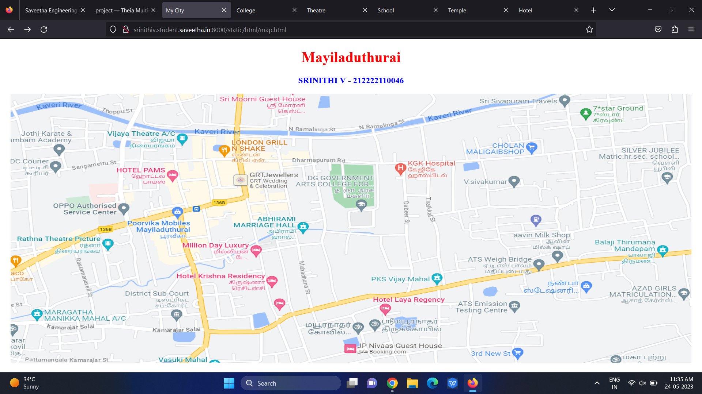
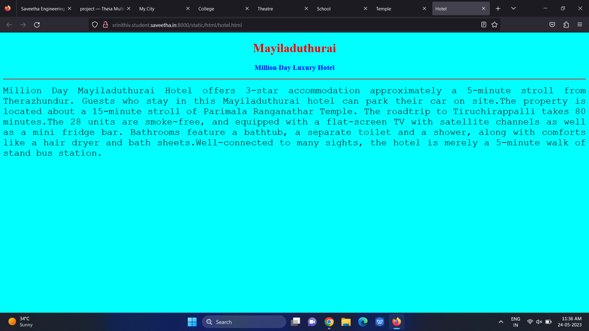
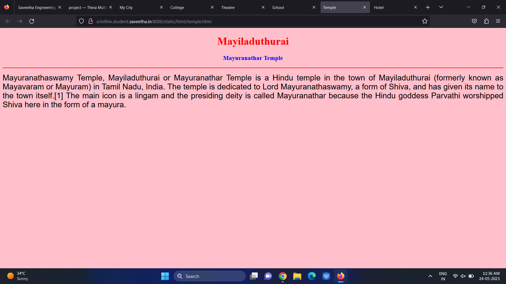
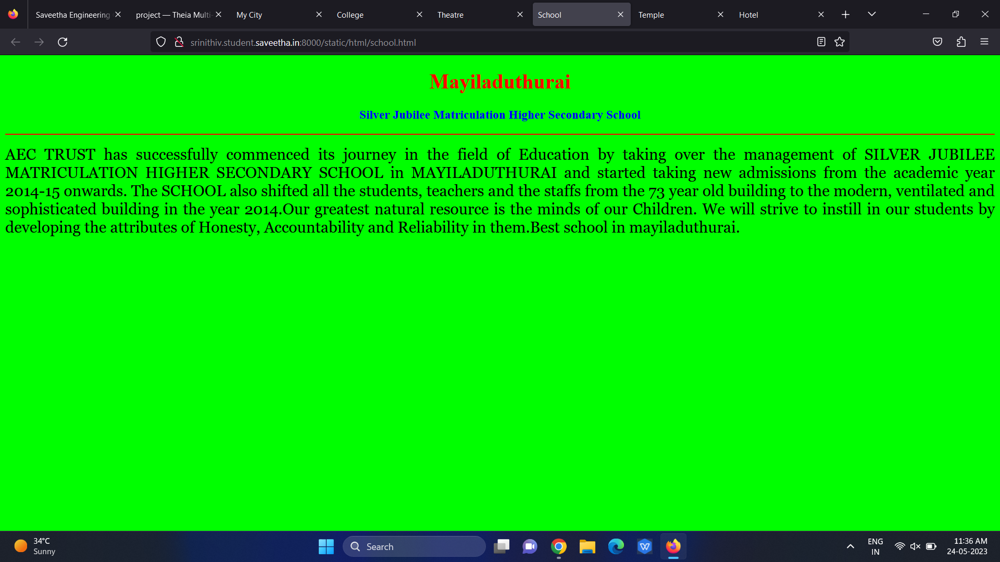
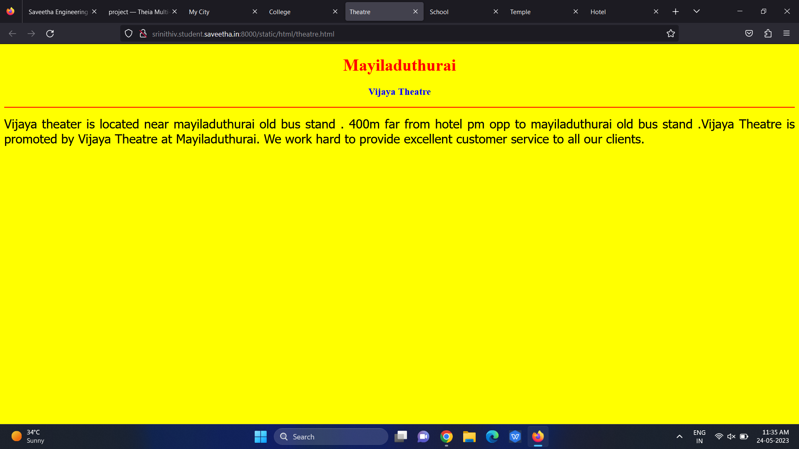
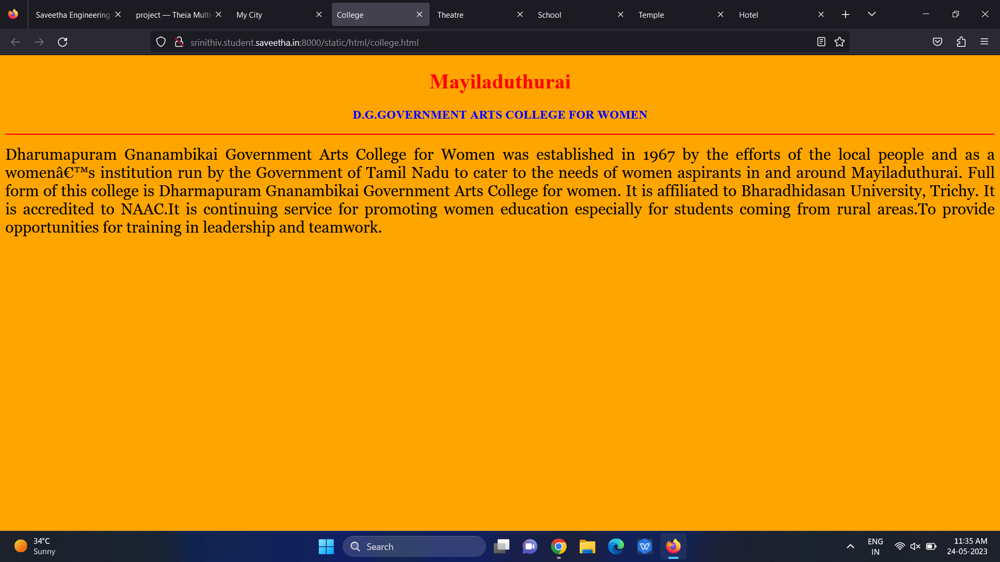
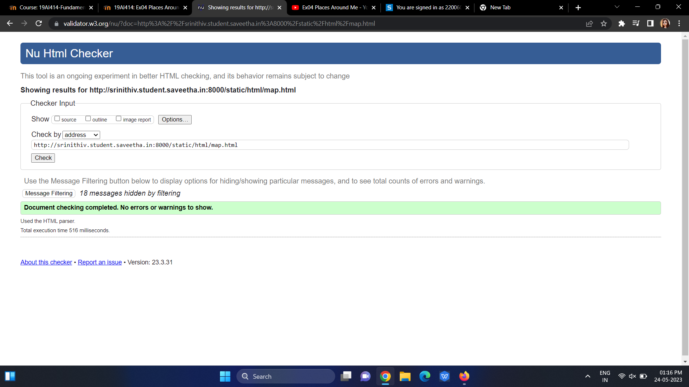

# Ex04 Places Around Me
## AIM
To develop a website to display details about the places around my house.

## DESIGN STEPS

### STEP 1
Create a Django admin interface.

### STEP 2
Download your city map from Google.

### STEP 3
Using ```<map>``` tag name the map.

### STEP 4
Create clickable regions in the image using ```<area>``` tag.

### STEP 5
Write HTML programs for all the regions identified.

### STEP 6
Execute the programs and publish them.

## CODE

Name : SRINITHI V

Reg.no : 212222110046

map.html
```
<!DOCTYPE html>
<html lang="en">
<head>
<title>My City</title>
</head>
<body>
<h1 align="center">
<font color="red"><b>Mayiladuthurai</b></font>
</h1>
<h3 align="center">
<font color="blue"><b>SRINITHI V - 212222110046</b></font>
</h3>
<center>

<map name="MyCity">
<area shape="rectangle" coords="1460,161,821,215" href="/static/html/school.html"
title="Silver Jubilee Matriculation Higher Secondary School">
<area shape="rectangle" coords="661,161,821,215" href="/static/html/college.html"
title="D.G.GOVERNMENT ARTS COLLEGE FOR WOMEN">
<area shape="rectangle" coords="562,161,821,520" href="/static/html/temple.html"
title="Mayuranathar Temple">
<area shape="rectangle" coords="312,41,672,106" href="/static/html/theatre.html"
title="Vijaya Theatre">
<area shape="rectangle" coords="406,161,716,365" href="/static/html/hotel.html"
title="Million Day Luxury Hote">
</map>
</center>
</body>
</html>
```
school.html
```
<!DOCTYPE html>
<html lang="en">
    <head>
        <title>School</title>
    </head>
    <body bgcolor="lime">
    <h1 align="center">
    <font color="red"><b>Mayiladuthurai</b></font>
    </h1>
    <h3 align="center">
    <font color="blue"><b>Silver Jubilee Matriculation Higher Secondary School</b></font>
    </h3>
    <hr size="3" color="red">
    <p align="justify">
    <font face="Georgia" size="5">
        AEC TRUST has successfully commenced its journey in the field of Education by taking over the management of SILVER JUBILEE MATRICULATION HIGHER SECONDARY SCHOOL in MAYILADUTHURAI and started taking new admissions from the academic year 2014-15 onwards. The SCHOOL also shifted all the students, teachers and the staffs from the 73 year old building to the modern, ventilated and sophisticated building in the year 2014.Our greatest natural resource is the minds of our Children. We will strive to instill in our students by developing the attributes of Honesty, Accountability and Reliability in them.Best school in mayiladuthurai.
    </font>
    </p>
    </body>
</html>
```
college.html
```
<!DOCTYPE html>
<html lang="en">
<head>
<title>College</title>
</head>
<body bgcolor="orange">
<h1 align="center">
<font color="red"><b>Mayiladuthurai</b></font>
</h1>
<h3 align="center">
<font color="blue"><b>D.G.GOVERNMENT ARTS COLLEGE FOR WOMEN</b></font>
</h3>
<hr size="3" color="red">
<p align="justify">
<font face="Georgia" size="5">
    Dharumapuram Gnanambikai Government Arts College for Women was established in 1967 by the efforts of the local people and as a women’s institution run by the Government of Tamil Nadu to cater to the needs of women aspirants in and around Mayiladuthurai. Full form of this college is Dharmapuram Gnanambikai Government Arts College for women. It is affiliated to Bharadhidasan University, Trichy. It is accredited to NAAC.It is continuing service for promoting women education especially for students coming from rural areas.To provide opportunities for training in leadership and teamwork.
</font>
</p>
</body>
</html>

```
temple.html
```
<!DOCTYPE html>
<html lang="en">
<head>
<title>Temple</title>
</head>
<body bgcolor="pink">
<h1 align="center">
<font color="red"><b>Mayiladuthurai</b></font>
</h1>
<h3 align="center">
<font color="blue"><b>Mayuranathar Temple</b></font>
</h3>
<hr size="3" color="red">
<p align="justify">
<font face="Arial" size="5">
Mayuranathaswamy Temple, Mayiladuthurai or Mayuranathar Temple is a Hindu temple in the town of Mayiladuthurai (formerly known as Mayavaram or Mayuram) in Tamil Nadu, India. The temple is dedicated to Lord Mayuranathaswamy, a form of Shiva, and has given its name to the town itself.[1] The main icon is a lingam and the presiding deity is called Mayuranathar because the Hindu goddess Parvathi worshipped Shiva here in the form of a mayura.
</font>
</p>
</body>
</html>
```
theatre.html
```
<!DOCTYPE html>
<html lang="en">
<head>
<title>Theatre</title>
</head>
<body bgcolor="yellow">
<h1 align="center">
<font color="red"><b>Mayiladuthurai</b></font>
</h1>
<h3 align="center">
<font color="blue"><b>Vijaya Theatre</b></font>
</h3>
<hr size="3" color="red">
<p align="justify">
<font face="Tahoma" size="5">
 Vijaya theater is located near mayiladuthurai old bus stand . 400m far from hotel pm opp to mayiladuthurai old bus stand .Vijaya Theatre is promoted by Vijaya Theatre at Mayiladuthurai. We work hard to provide excellent customer service to all our clients.
</font>
</p>
</body>
</html>
```
hotel.html
```
<!DOCTYPE html>
<html lang="en">
<head>
<title>Hotel</title>
</head>
<body bgcolor="cyan">
<h1 align="center">
<font color="red"><b>Mayiladuthurai</b></font>
</h1>
<h3 align="center">
<font color="blue"><b>Million Day Luxury Hotel</b></font>
</h3>
<hr size="3" color="red">
<p align="justify">
<font face="Courier New" size="5">
Million Day Mayiladuthurai Hotel offers 3-star accommodation approximately a 5-minute stroll from Therazhundur. Guests who stay in this Mayiladuthurai hotel can park their car on site.The property is located about a 15-minute stroll of Parimala Ranganathar Temple. The roadtrip to Tiruchirappalli takes 80 minutes.The 28 units are smoke-free, and equipped with a flat-screen TV with satellite channels as well as a mini fridge bar. Bathrooms feature a bathtub, a separate toilet and a shower, along with comforts like a hair dryer and bath sheets.Well-connected to many sights, the hotel is merely a 5-minute walk of stand bus station.
</font>
</p>
</body>
</html> 
```

## OUTPUT













## HTML VALIDATOR



## RESULT
The program for implementing image maps using HTML is executed successfully.
